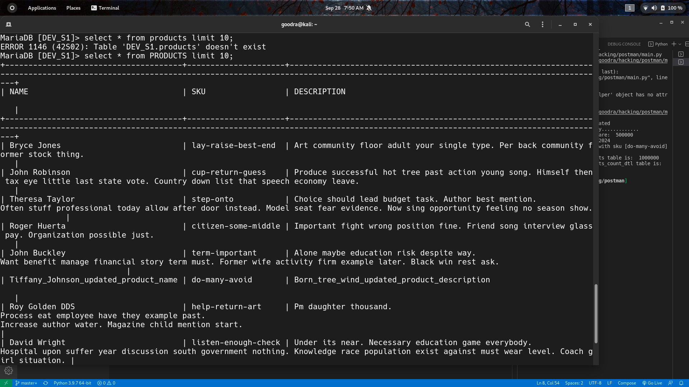
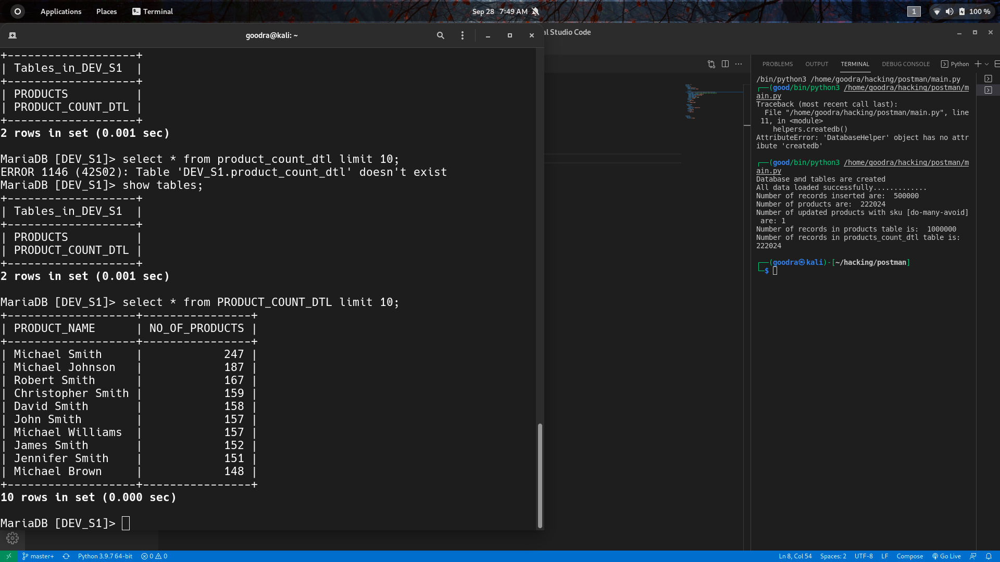

# Large file processor

Aim is to build a system which is able to handle long running processes in a distributed fashion.
## Problem statement

We need to be able to import products from a CSV file and into a database. There are half a million product details to be imported into the database. You can find the CSV file here in a compressed format Large File processing - Assignment.

After the import, we will run an aggregate query to give us no. of products with the same name.

## Points to achieve
* The code should follow concept of OOPS
* Support for regular non-blocking parallel ingestion of the given file into a table. Consider thinking about the scale of what should happen if the file is to be processed in 2 mins.
* Support for updating existing products in the table based on `sku` as the primary key. 
* All 500k rows to be inserted into a single table
* An aggregated table on above rows with `name` and `no. of products` as the columns.

## Notes
* You can choose programming language and framework of your choice
* You can choose a database of your preference
* You can use any design pattern you prefer to solve the above problems
## Hints

Ingest the same file at least 2 times before submitting the assignment, without truncating the products table. (This is to validate how your code works in case of updates)
## Getting Started

### Introduction 
### Installation
* Clone this repository
```bash
git clone  git clone https://github.com/shreyanshjain7174/postman.git
cd postman
```
* Install Docker
```bash
sudo apt-get install update
sudo apt-get remove docker docker-engine docker.io
sudo apt install docker.io
sudo systemctl start docker
sudo systemctl enable docker
sudo usermod -aG docker $USER
```

### Steps to run code
```bash
1. docker-compose up -d; 
2. docker attach postman_postman_1 (container name); 
3. docker ps; 
```
check the container name and then insert in the command.

## Over all structure
**Note : This just gives a rough representation of my thought process and will be helpful in understanding the overall thing. However it will map broadly with the code but may not map exactly.**

### Database Creation Script:
----------------------------
```
CREATE DATABASE IF NOT EXISTS DEV_S1 ; 
```
### Table Creation Script:
```
CREATE TABLE IF NOT EXISTS DEV_S1.PRODUCTS(NAME VARCHAR(50), SKU varchar(100), DESCRIPTION varchar(250));
CREATE TABLE IF NOT EXISTS DEV_S1.PRODUCT_COUNT_DTL(PRODUCT_NAME varchar(50), NO_OF_PRODUCTS int);

aggregate_query= INSERT INTO {}.PRODUCT_COUNT_DTL
                SELECT NAME PRODUCT_NAME, COUNT(NAME) NO_OF_PRODUCTS FROM {}.PRODUCTS 
                GROUP BY NAME ORDER BY COUNT(NAME) DESC;
```

## Results:
--------------------------------------
1. Total number of Products = 500000 (Remaining are updated because of same 'sku' values)
2. Total Aggregation count = 222024
3. Sample 10 rows from products data:

* [productstable](https://github.com/shreyanshjain7174/postman/blob/main/data/table.png)


* [sample data](https://github.com/shreyanshjain7174/postman/blob/main/data/sample.png)


* [aggregate result](https://github.com/shreyanshjain7174/postman/blob/main/data/results.png)

## Points Achieved:
-------------------------------------
1. Code Followed OOPS concepts
2. Supports for updating existing products in the table based on 'sku' as the primary key.
3. All product tables are ingested into a single table.
4. Created an aggregated table on above rows with name and no of products as columns.

## Improvements:
------------------------------------------
Since time is a concern, To increase the speed of processing concepts such as Multi-processing can be used and to read and test, instead of pandas Pyspark
can be used which is 100x as compared to the module being used in this code.
## Author
* [Shreyansh](https://github.com/shreyanshjain7174)
